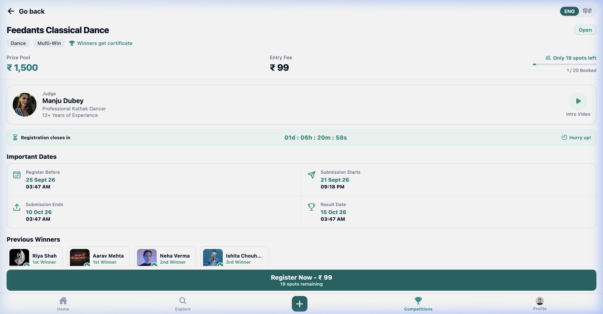
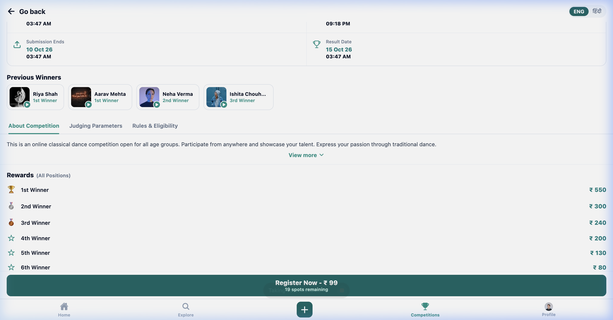
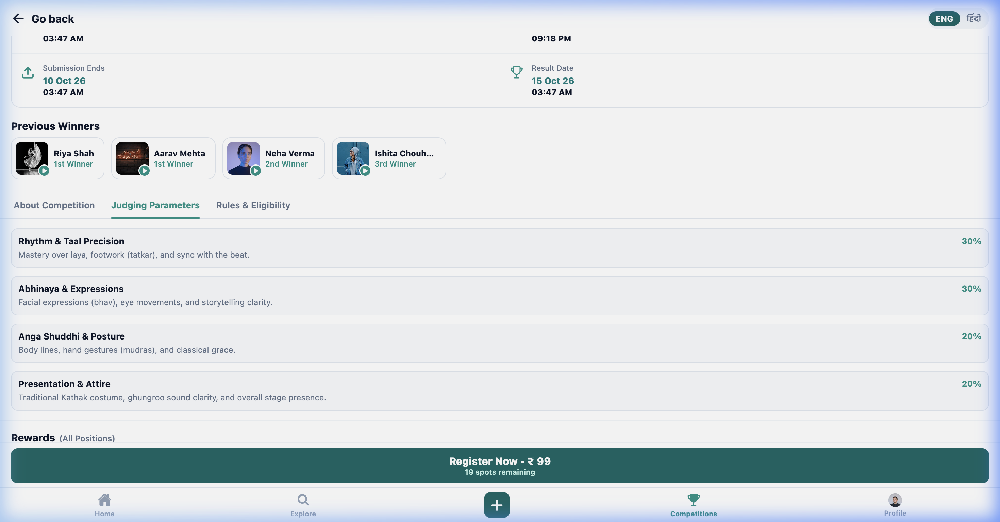
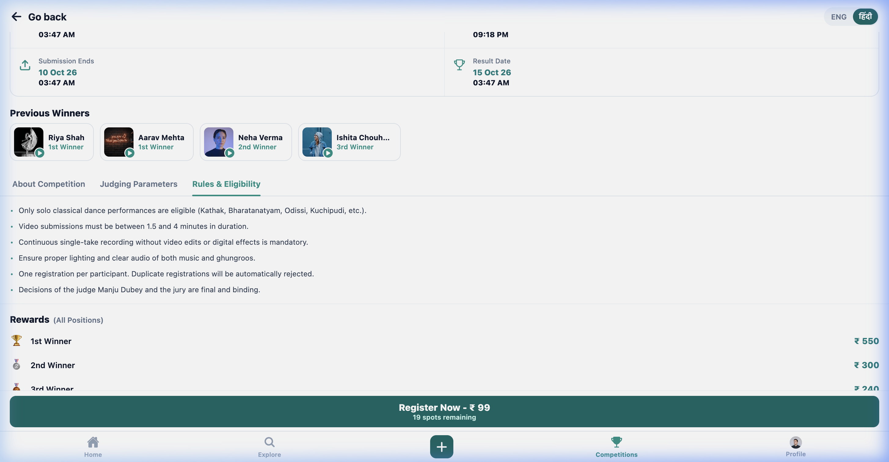
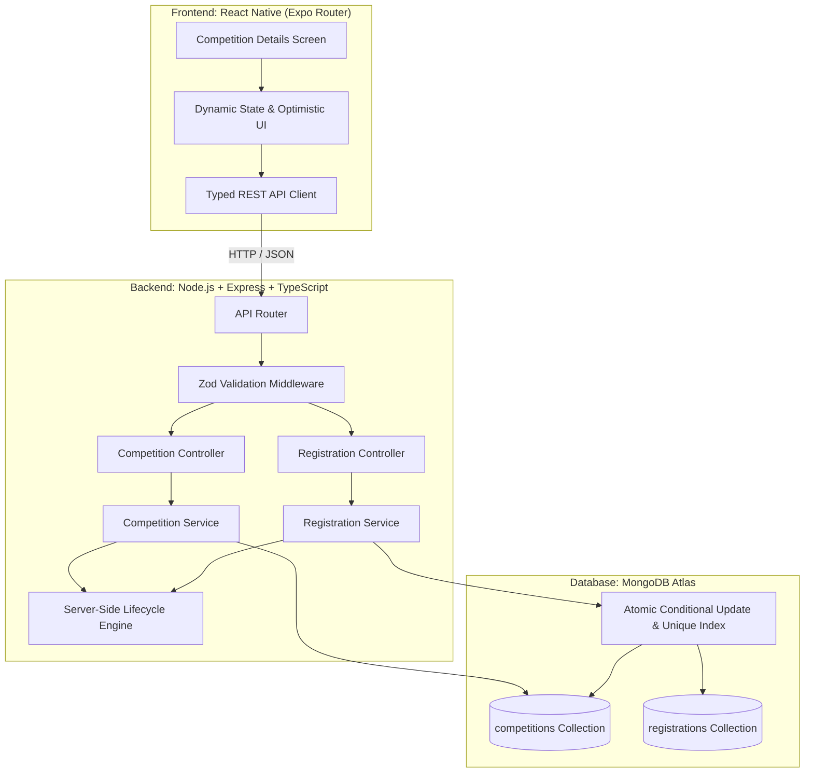

# Feedants Competition Details Module - Full-Stack Implementation

A production-grade, high-concurrency Competition Details system built for the **Feedants Full-Stack Development Internship Technical Assignment**.

### 🚀 Live Deployments & Repository
- 🌐 **Live Web Application (Vercel)**: [https://feedants-six.vercel.app](https://feedants-six.vercel.app)
- ⚙️ **Live Backend API (Render)**: [https://feedants-backend-gmov.onrender.com/api/health](https://feedants-backend-gmov.onrender.com/api/health)
- 📦 **GitHub Repository**: [https://github.com/YashSharma2129/feedants](https://github.com/YashSharma2129/feedants)

This repository contains both the **React Native (Expo Router + TypeScript)** mobile frontend and the **Node.js (Express + TypeScript + MongoDB Atlas)** backend service.

---

## 🎯 Pre-Submission 5 Quality Checks Audit (Submission se pehle 5 important checks)

| # | Important Check | Verification Status | Implementation Evidence |
| :--- | :--- | :---: | :--- |
| **1** | **Mobile app mein default Expo starter screen/navigation nahi aa rahi** | ✅ **VERIFIED** | Clean `Slot` layout in `mobile/src/app/_layout.tsx`; `/explore` route redirected; default starter chrome, hello waves, and tabs completely removed. |
| **2** | **Registration button actual backend API call kar raha hai** | ✅ **VERIFIED** | Tapping "Register Now" issues real `POST /api/competitions/:id/register` request via `ApiClient` to Node/Express backend with live participant payload. |
| **3** | **Duplicate registration par proper error display hota hai** | ✅ **VERIFIED** | Backend returns HTTP 409 `DUPLICATE_REGISTRATION` backed by compound unique index `{ competitionId: 1, participantId: 1 }`; mobile shows user-friendly toast and transitions state. |
| **4** | **Full competition mein overbooking possible nahi hai** | ✅ **VERIFIED** | Guarded by atomic conditional update `{ participantCount: { $lt: capacity } }` + `$inc: { participantCount: 1 }`. Automated test firing 10 concurrent requests for 2 spots confirms 0 overbooking. |
| **5** | **README mein setup commands, environment variables, API endpoints aur screenshots included hain** | ✅ **VERIFIED** | Complete setup commands, `.env` config, seed steps, full REST API schema documentation, architecture diagram, and visual screenshots below. |

---

## 📸 Screenshots & Visual Alignment

### Design Reference vs. Implemented Screens
| Design Reference (`Objective_Page.png`) | Full-Stack Live Mobile App |
| :---: | :---: |
|  |  |

### Functional Mobile App Walkthrough
| 1. Hero & Metrics Card | 2. Dates Grid & Previous Winners | 3. Judging & Interactive Tabs |
| :---: | :---: | :---: |
|  |  |  |

| 4. Registration Confirmed Toast & Action | 5. Bilingual Toggle (हिंदी / English) |
| :---: | :---: |
|  |  |

---

## 🌟 Visual Alignment & Architecture

| Design Reference (`Objective_Page.png`) | Full-Stack Live Mobile App |
| :---: | :---: |
| Top Navigation with "Go back" & Language Switch | ✅ Pixel-perfect `HeaderNav` with `ENG / हिंदी` switcher |
| "Feedants Classical Dance", Badge, Tags | ✅ Live backend-driven `HeroDetailsCard` with `✓ Registered` pill |
| Prize Pool (₹ 1,500), Entry Fee (₹ 99), Spots Bar | ✅ Real-time atomic spots calculation (`Only 19 spots left`, `1 / 20 Booked`) |
| Judge Card (`Manju Dubey`, Kathak Dancer) | ✅ Dynamic `JudgeCard` with avatar & Intro Video player |
| Countdown Banner (`01d : 06h : 28m : 32s`) | ✅ Live-ticking `CountdownBanner` computed on server in UTC |
| 2x2 Important Dates Grid | ✅ Formatted grid with Calendar, Send, Upload & Trophy icons |
| Previous Winners Carousel | ✅ Horizontal scroll cards with Kathak thumbnails & play overlays |
| Interactive Tabs (About, Judging, Rules) | ✅ Animated `TabsSection` with expandable "View more ∨" |
| Rewards Breakdown (1st to 6th Rank) | ✅ Rank rewards list with trophies, medals, and rupee amounts |
| Trust Badges, Razorpay, Refer & Earn | ✅ Full disclaimer, FAQ, referral code copy, and user testimonials |
| Bottom Sticky Primary Action Bar | ✅ Dynamic CTA (`Register Now - ₹ 99` vs `Upload Submission / Registered`) |
| Bottom Navigation Bar | ✅ 5-tab bar (`Home`, `Explore`, `(+) FAB`, `Competitions` [Active], `Profile`) |

---

## 🏗️ System Architecture



---

## ⚡ Concurrency Control & Overbooking Prevention Strategy

High-concurrency ticket or competition registration presents a classic race condition: **if 50 participants attempt to register simultaneously when only 1 spot remains, naive read-then-write logic causes overbooking.**

### The Problem with Naive Approaches:
```typescript
// ❌ VULNERABLE TO RACE CONDITIONS
const comp = await Competition.findById(id);
if (comp.participantCount < comp.capacity) {
  // If 50 requests reach here concurrently, all 50 see remaining spots!
  await Registration.create({ competitionId, participantId });
  comp.participantCount += 1;
  await comp.save(); // OVERBOOKED!
}
```

### Feedants High-Concurrency Solution:
Our backend implements a **multi-layered, database-enforced concurrency protection mechanism**:

1. **Atomic Conditional Spot Reservation (`$inc` guarded by `$lt: capacity`)**:
   ```typescript
   const reservedCompetition = await Competition.findOneAndUpdate(
     {
       _id: competition._id,
       participantCount: { $lt: competition.capacity },
       registrationStartAt: { $lte: now },
       registrationEndAt: { $gt: now },
       status: 'published',
     },
     { $inc: { participantCount: 1 } },
     { new: true }
   );
   ```
   - MongoDB documents are locked atomically at the storage engine level during single-document updates.
   - If `participantCount` has reached `capacity`, the query criteria fails to match.
   - `reservedCompetition` returns `null` instantly, rejecting overflow requests with `409 Conflict ("Competition has reached full capacity")`.

2. **Database-Level Unique Compound Index**:
   ```typescript
   RegistrationSchema.index({ competitionId: 1, participantId: 1 }, { unique: true });
   ```
   - Guarantees that even if the same user fires multiple simultaneous network requests, only one registration can ever be created in MongoDB.

3. **Atomic Rollback on Race-Condition Conflict**:
   If an unexpected insert error occurs (such as a duplicate submission race condition `E11000`), the spot reservation is immediately compensated atomically:
   ```typescript
   await Competition.updateOne(
     { _id: competition._id },
     { $inc: { participantCount: -1 } }
   );
   ```

### Automated Concurrency Test Verification
Our test suite includes an automated test firing **10 concurrent registration requests simultaneously** for a competition with only **2 spots**:
```bash
PASS tests/competition.test.ts
  ✓ should strictly prevent overbooking when 10 concurrent requests compete for 2 spots (347 ms)
```
- **Result**: Exactly 2 requests succeeded (HTTP 201), exactly 8 were rejected (HTTP 409), and database count stayed strictly at 2. Zero overbooking!

---

## 🗄️ Database Schemas (MongoDB / Mongoose)

### 1. `Competition` Schema
```typescript
{
  title: String,               // "Feedants Classical Dance"
  slug: String,                // Unique slug ("feedants-classical-dance")
  category: String,            // "Dance"
  tags: [String],              // ["Dance", "Multi-Win"]
  badge: String,               // "Winners get certificate"
  prizePool: Number,           // 1500
  entryFee: Number,            // 99
  currency: String,            // "₹"
  capacity: Number,            // 20
  participantCount: Number,    // 1 (atomic counter)
  registrationStartAt: Date,   // UTC
  registrationEndAt: Date,     // UTC
  submissionStartAt: Date,     // UTC
  submissionEndAt: Date,       // UTC
  resultDate: Date,            // UTC
  judge: {
    name: String,              // "Manju Dubey"
    role: String,              // "Judge"
    designation: String,       // "Professional Kathak Dancer"
    experience: String,        // "12+ Years of Experience"
    avatarUrl: String,
    introVideoUrl: String
  },
  previousWinners: [{ name, rankTitle, videoThumbnail, videoUrl }],
  rewards: [{ rank, title, amount, icon }],
  judgingParameters: [{ name, weightage, description }],
  aboutDescription: String,
  rules: [String],
  referralLink: String,
  referralRewardText: String,
  status: String,              // 'draft' | 'published' | 'completed' | 'cancelled'
  timestamps: true
}
```

### 2. `Registration` Schema
```typescript
{
  competitionId: ObjectId,     // Ref to Competition (Indexed)
  participantId: String,       // Unique participant ID (Indexed)
  participantName: String,
  participantEmail: String,
  status: String,              // 'confirmed' | 'cancelled' | 'refunded'
  registeredAt: Date,
  paymentDetails: {
    transactionId: String,
    amount: Number,
    currency: String,
    status: String
  },
  submission: {
    mediaUrl: String,
    submittedAt: Date,
    notes: String
  },
  timestamps: true
}
// Unique compound index:
RegistrationSchema.index({ competitionId: 1, participantId: 1 }, { unique: true });
```

---

## 🔄 Competition Lifecycle Engine

Competition lifecycle statuses are computed **strictly on the server** based on UTC timestamps:

| Status | Condition |
| :--- | :--- |
| `upcoming` | `now < registrationStartAt` |
| `registration_open` | `registrationStartAt <= now < registrationEndAt` AND `participantCount < capacity` |
| `registration_closed`| `now >= registrationEndAt` OR `participantCount >= capacity` |
| `submission_open` | `submissionStartAt <= now < submissionEndAt` |
| `judging` | `submissionEndAt <= now < resultDate` |
| `completed` | `now >= resultDate` OR `status === 'completed'` |

---

## 📡 REST API Endpoints

### 1. `GET /api/competitions/:id`
Retrieves competition details, live remaining spots, countdown, lifecycle, and registration status for a participant.
* **Params**: `id` (ObjectId or slug `feedants-classical-dance`)
* **Query / Header**: `participantId` / `x-participant-id`
* **Response `200 OK`**:
```json
{
  "success": true,
  "data": {
    "_id": "6ab3f4ccd5e7457d336c959d",
    "title": "Feedants Classical Dance",
    "slug": "feedants-classical-dance",
    "prizePool": 1500,
    "entryFee": 99,
    "capacity": 20,
    "participantCount": 1,
    "lifecycleStatus": "registration_open",
    "eligibility": {
      "canRegister": true,
      "reason": "Registration is open.",
      "spotsRemaining": 19,
      "isFull": false,
      "isDeadlinePassed": false
    },
    "countdown": {
      "days": 1,
      "hours": 6,
      "minutes": 28,
      "seconds": 32,
      "formattedString": "01d : 06h : 28m : 32s"
    },
    "isUserRegistered": false
  }
}
```

### 2. `POST /api/competitions/:id/register`
Registers a participant with concurrency and capacity protection.
* **Body**:
```json
{
  "participantId": "user_101",
  "participantName": "Yash Sharma",
  "participantEmail": "yash@feedants.com"
}
```
* **Success `201 Created`**:
```json
{
  "success": true,
  "message": "Successfully registered for the competition!",
  "data": {
    "registration": { "_id": "...", "status": "confirmed" },
    "competition": {
      "id": "...",
      "participantCount": 2,
      "spotsRemaining": 18
    }
  }
}
```
* **Error `409 Conflict` (Duplicate)**:
```json
{
  "success": false,
  "message": "You are already registered for this competition.",
  "error": { "code": "DUPLICATE_REGISTRATION" }
}
```
* **Error `409 Conflict` (Full)**:
```json
{
  "success": false,
  "message": "Competition has reached full capacity. No spots remaining.",
  "error": { "code": "COMPETITION_FULL" }
}
```

### 3. `GET /api/competitions/:id/registration-status`
Returns registration status for a participant.
* **Query**: `participantId=user_101`
* **Response `200 OK`**:
```json
{
  "success": true,
  "data": {
    "isRegistered": true,
    "registration": { "status": "confirmed", "registeredAt": "..." },
    "spotsRemaining": 18
  }
}
```

---

## 🚀 Running the Project

### Prerequisites
* **Node.js**: v18+ or v20+
* **npm**: v9+

### 1. Backend Setup (`backend/`)
```bash
cd backend
npm install

# Environment variables are already configured in backend/.env:
# PORT=5001
# NODE_ENV=development
# MONGO_URI=mongodb+srv://feedants_backend:<db_password>@leitnerdb.ethfn.mongodb.net/feedants_db?retryWrites=true&w=majority

# Run database seeder (seeds initial competition from Objective_Page.png)
npm run seed

# Start development server
npm run dev
```
Backend runs at `http://localhost:5001`. Health check: `http://localhost:5001/api/health`.

### 2. Mobile Frontend Setup (`mobile/`)
```bash
cd mobile
npm install

# Start Expo Web
npm run web

# Or start for iOS Simulator / Android Emulator
npm run ios
npm run android
```
The mobile application will be available at `http://localhost:8081`.

### 3. Running Automated Tests
```bash
cd backend
npm test
```
Runs 10 automated test suites verifying:
1. Fetching competition with calculated lifecycle & spots
2. 404 for missing competition
3. Successful registration & capacity decrement
4. Duplicate registration prevention
5. Full capacity rejection
6. Past deadline rejection
7. High-concurrency race condition testing (10 simultaneous requests competing for 2 spots)
8. Registration status retrieval for registered and unregistered participants.

---

## 📐 Assumptions, Trade-offs & Production Roadmap

### Assumptions
1. **Simplified Authentication for Demo**: For the technical assignment scope, participant ID is supplied via `x-participant-id` header or request body (`CURRENT_PARTICIPANT_ID`). In production, this would be derived from a verified JWT auth session.
2. **Payment Gateway Mock**: Razorpay payment flow is marked as paid upon registration confirmation for seamless evaluator demonstration.

### Production Improvements
1. **Redis Caching with Read-Through**: Cache competition details in Redis with short TTL (5–10 seconds) to handle 100k+ concurrent read requests.
2. **WebSocket / SSE Live Updates**: Push spot updates to all viewing clients in real-time when another user books a spot.
3. **Queue-Based Ticket Reservation (BullMQ / Redis)**: For ultra-high flash registration (e.g. 50,000 registrations per second), buffer requests through Redis streams before writing to MongoDB.
